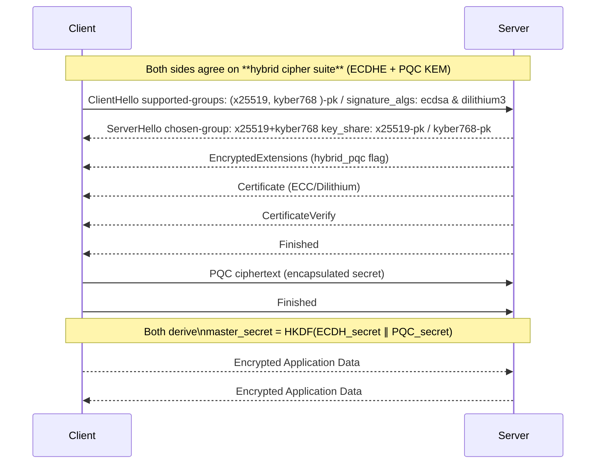

# Post-Quantum-Cryptography (PQC) and the Nginx Server

Recently I became slightly obsessed with post quantum cryptography. I see it like an IT apocolypse, an impending doom of sorts - but none of my peers seem interested in. We are upon the age of quantum computing, where data can not only represent 0 and 1, but also superposition of 0 and 1, somewhere between 0 and 1 - the quantum state. This notion is powerful as it moves data representation beyond the classical binary world and into another realm. One of the main problems with current quantum computing methods is that data in this superposition state is unstable. With this the notion of 'error correction' is frequently mentioned as a means to measure the realiability of the output or calculations made by quantum computers. An example of this is cooling, which is used to stabilize the quantum state and improving error correction. 

In 2024 google performed a quantum experiment with their Willow chip, where they were able to perform a calculation that  would take classical computers billions of years to perform and in just a matter of minutes. This is a major milestone in the field of quantum computing. 

`Willow performed a standard benchmark computation in under five minutes that would take one of today’s fastest supercomputers 10 septillion (that is, 1025) years — a number that vastly exceeds the age of the Universe.`

So things are moving fast. The reality is that you, me and Bob next door wouldnt have any real world use of a quantum computer. 
Current computing offers us enough speed to perform any real world tasks. So who cares about quantum computers, right? 

Personally the interest in quantum computing is not about the quantum computers themselves, but that they will break public key crytpoggraphy, which runs muchs of the intertnet. Having vastly superior computing power gives rogue actors the ablity to break current security standards, opening up the WORLD to attacks. Quantum computers will break standard 2048-bit RSA public key, the backbone of modern internet security, in a matter of hours. In stark contrast, the most powerful classical supercomputers would require an estimated 300 trillion years to accomplish the same feat, rendering today's encryption obsolete in a post-quantum worldAll modern RSA cryptography is based on factorization of prime numbers. https://www.classiq.io/insights/shors-algorithm-explained


## Who are the NIST?

In 2024 the NIST ( National Institute of Standards and Technology ) selected 7 post-quantum algorithms to be standardized. The NIST are.


"NIST develops cybersecurity standards, guidelines, best practices, and other resources to meet the needs of U.S. industry, federal agencies and the broader public."

They are basically the ones we all listen to when it comes to standardization of new cryptography primitives. Of the various algorithms selected is the much anticipated CRYSTALS-KYBER. A module-lattice based algorithm that can be used for KEX or Key-Exchange. This is what we will be using for our post-quantum TLS encryption and is part of the Open Quantum Safe library sidelining OpenSSL.

The shift in paradigm excites the likes of a jack of all trades Software Engineer like myself. So how does one get their hands dirty with post-quantum cryptography? Knowing very little about TLS, it felt like one of the core areas affected by this paradigm shift. So I thought I would try to build an nginx webserver with post-quantum TLS encryption. 

Let's start with the coolest of the new algorithms CRYSTALS KYBER or ML-KEM module lattice Key Exchange Mechanism.

## What is Key Exchange?

I got Geminin to describe it like this:

´alice has a secret key and a pub key.
bob has a secret key and a pub key.

alice sends her pub key to bob.
bob sends his pub key to alice.

alice uses her secret key and bob's pub key to make a shared secret key.
bob uses his secret key and alice's pub key to make the same shared secret key.

Now alice and bob have a shared secret key.´

That shared key is used to encrypt all application data after a TLS handshake between a client ( e.g you browser ) and a server. Its essentially the fundamental way we protect all data moving through the internet. 

For me it made sense to start with TLS, because it felt so fundamental to the whole ecosystem. That substrata that underpins the internet.

 ## The Nginx Stack ## 

A production-ready post-quantum cryptography (PQC) enabled nginx server with Node.js backend in a conatiner. This setup integrates Open Quantum Safe (OQS) libraries for hybrid traditional + post-quantum TLS encryption. Implementing PQC on nginx was going to be a valuable lesson on what tools already exist and how we can upgrade the foundation of all client server communication.

Learning outcomes:
- How can we utilise the Open Quantum Safe tooling
- How can we get Kyber into an Nginx server for TLS
- How can we test that our pqc cipher is being used

"The Open Quantum Safe (OQS) project is an open-source project that aims to support the transition to quantum-resistant cryptography."

And they have a docker image available on their github, awesome!

## The Architecture

**Routing**: OQS-enabled nginx reverse proxy (HTTP port 8080, HTTPS port 8443)
**Backend**: Node.js Express API server (internal port 3000)
**Containerization**: Docker Compose orchestrates both services
**Security**: Post-quantum certificates with hybrid cipher suites (ML-DSA-44, X25519MLKEM768)

## Hybrid Cryptography Explained

One of the most importan fators in this switch to post quantum cryptography has been termed 'crypto agility'. This means that implmementors will need to be able to write new code into systems which can elegantly co-exist with current implementations. Why? So that current systems do not break and the migrations happen with little headache. Harnessing OQS in this project will give us crypto agility out of the box, such that we are relived of writing that code for now.

### Two Types of "Hybrid" in This Setup

We will build with this in mind. These are the exchanges we will offer.

### Client Connection Examples

|Client Type | Request Method | Key Exchange | Signature | Security Level |
|-------------|---------------|--------------|-----------|----------------|
| **OQS Client (Explicit PQ)** | `--curves X25519MLKEM768` | X25519MLKEM768 | mldsa44 | **Full Quantum-Safe** |
| **OQS Client (Auto)** | No curve specified | X25519 | RSA-PSS | Classical Fallback |
| **Traditional Browser** | Standard HTTPS | X25519 | RSA-PSS | Classical Security |

Important thing to note here is `--curves X25519MLKEM768` MLKEM768 is CRYTALS-KYBER with 769 security level on par with AES-192.

## Post-Quantum Cryptography Features

### ✅ Let's Implement
- **Hybrid Key Exchange Algorithm**: X25519MLKEM768 (simultaneous classical + post-quantum protection)

KEM is slightly different to traditional Diffie-Hellman, in that the public key sent by the client is encapsulated into a ciphertext when send back from the server. I won't go into this more here, but this explains it well https://medium.com/identity-beyond-borders/crystals-kyber-the-key-to-post-quantum-encryption-3154b305e7bd

- So our pqc certificates will be made using ML-DSA-44 (NIST standardized quantum-safe digital signatures) and our symmetric key will be AES-256-GCM, AES 256 is already quantumm safe and will never leave the server.

So far will make sure we can present both RSA and ML-DSA-44 certificates based on client capabilities

### Security Status
This Hybrid algorithm approach will provide protection against both classical and quantum attacks. Clients can explicitly request post-quantum algorithms for full quantum safety and Traditional clients will automatically fall back to secure classical algorithms, allowing 'Readyness' for widespread post-quantum adoption with smooth migration path.


### Hybrid TLS Handshake Flow



## Building the Project

Let's build this step by step. You'll need Docker installed on your machine.

### Project Structure
```
pqc-nginx/
├── docker-compose.yml
├── nginx-conf/
│   └── nginx.conf
├── certs/
├── backend/
│   ├── server.js
│   └── package.json
└── scripts/
    └── generate-certificates.sh
```

### Step 1: Create the Backend Server

First, let's create a simple Node.js backend to serve behind our nginx proxy:

```javascript
// backend/server.js
const express = require('express');
const app = express();
const port = 3000;

app.get('/api/health', (req, res) => {
  res.json({ 
    status: 'healthy', 
    timestamp: new Date().toISOString(),
    message: 'Post-quantum nginx backend is running!' 
  });
});

app.get('/nginx-health', (req, res) => {
  res.json({ 
    nginx: 'proxy working',
    backend: 'connected',
    quantum_safe: true
  });
});

app.listen(port, () => {
  console.log(`Backend server running on port ${port}`);
});
```

```json
// backend/package.json
{
  "name": "pqc-backend",
  "version": "1.0.0",
  "main": "server.js",
  "dependencies": {
    "express": "^4.18.2"
  },
  "scripts": {
    "start": "node server.js"
  }
}
```

  ## During the TLS handshake

  1. Client generates both an X25519 keypair AND an MLKEM768 keypair
  2. Client sends both public keys to the server
  3. Server performs both X25519 ECDH AND MLKEM768 encapsulation
  4. Server sends back the X25519 result AND the MLKEM768 ciphertext
  5. Both sides combine the shared secrets from both algorithms into a single master secret

  The math:
  final_shared_secret = KDF(x25519_shared_secret || mlkem768_shared_secret)

  Security benefit:
  - If quantum computers break MLKEM768 → X25519 still protects you
  - If classical computers break X25519 → MLKEM768 still protects you
  - An attacker needs to break BOTH algorithms to compromise the connection

  So "hybrid" means the algorithm provides dual protection by running two different mathematical approaches in parallel, not that it chooses between them.
  The TLS connection is secured by the combination of both.

### Step 2: Configure Nginx for Post-Quantum

The key difference from regular nginx is using the OQS-enabled image and configuring quantum-safe cipher suites:

```nginx
# nginx-conf/nginx.conf
events {
    worker_connections 1024;
}

http {
    include /opt/nginx/conf/mime.types;
    default_type application/octet-stream;
    
    # Upstream backend
    upstream backend {
        server backend:3000;
    }

    # HTTP server (redirect to HTTPS)
    server {
        listen 8080;
        return 301 https://$host:8443$request_uri;
    }

    # HTTPS server with post-quantum crypto
    server {
        listen 8443 ssl;
        server_name localhost;

        # Post-quantum certificates (order matters!)
        ssl_certificate /etc/nginx/certs/server_mldsa44.crt;
        ssl_certificate_key /etc/nginx/certs/server_mldsa44.key;
        
        # Traditional fallback certificates
        ssl_certificate /etc/nginx/certs/server_rsa.crt;
        ssl_certificate_key /etc/nginx/certs/server_rsa.key;

        # Critical: Post-quantum curve configuration
        ssl_ecdh_curve X25519MLKEM768:mlkem768:X25519:P-256;
        ssl_protocols TLSv1.3;
        
        # Security headers
        ssl_prefer_server_ciphers off;
        ssl_session_cache shared:SSL:10m;
        ssl_session_timeout 10m;

        location / {
            proxy_pass http://backend;
            proxy_set_header Host $host;
            proxy_set_header X-Real-IP $remote_addr;
            proxy_set_header X-Forwarded-For $proxy_add_x_forwarded_for;
            proxy_set_header X-Forwarded-Proto $scheme;
        }
    }
}
```

### Step 3: Docker Compose Setup

```yaml
# docker-compose.yml

services:
  nginx:
    image: openquantumsafe/nginx:latest
    ports:
      - "8080:8080"
      - "8443:8443"
    volumes:
      - ./nginx-conf/nginx.conf:/opt/nginx/nginx-conf/nginx.conf:ro
      - ./certs:/etc/nginx/certs:ro
    depends_on:
      - backend
    networks:
      - pqc-network

  backend:
    build: ./backend
    networks:
      - pqc-network
    environment:
      - NODE_ENV=production

networks:
  pqc-network:
    driver: bridge
```

### Step 4: Generate Post-Quantum Certificates

This is where the magic happens. We use OQS tools to create certificates with post-quantum algorithm:

```bash
#!/bin/bash
# scripts/generate-certificates.sh

mkdir -p certs

# Generate post-quantum certificates (ML-DSA-44)
docker run --rm -v $(pwd)/certs:/certs openquantumsafe/openssl \
  req -x509 -new -newkey mldsa44 -keyout /certs/server_mldsa44.key \
  -out /certs/server_mldsa44.crt -nodes -subj "/CN=localhost" -days 365

# Generate traditional certificates (RSA fallback)
docker run --rm -v $(pwd)/certs:/certs openquantumsafe/openssl \
  req -x509 -new -newkey rsa:2048 -keyout /certs/server_rsa.key \
  -out /certs/server_rsa.crt -nodes -subj "/CN=localhost" -days 365

echo "Certificates generated successfully!"
```

### Step 5: Build and Run

```bash
# Make the script executable
chmod +x scripts/generate-certificates.sh

# Generate certificates
./scripts/generate-certificates.sh

# Build and run the stack
docker-compose up --build
```

## What Makes This Quantum-Safe?

Now let's examine the specific changes that enable post-quantum protection:

### 1. Container Choice
**Changed**: Using `openquantumsafe/nginx:latest` instead of standard nginx
**Why**: Standard nginx doesn't include OQS libraries for post-quantum algorithms

### 2. Certificate Algorithm
**Changed**: `mldsa44` instead of RSA for digital signatures
**Why**: ML-DSA-44 is NIST-standardized and quantum-resistant, while RSA can be broken by Shor's algorithm

### 3. Key Exchange Curves
**Changed**: `ssl_ecdh_curve X25519MLKEM768:mlkem768:X25519:P-256`
**Why**: X25519MLKEM768 combines classical X25519 with post-quantum MLKEM768 for hybrid protection

### 4. TLS Protocol Restriction
**Changed**: `ssl_protocols TLSv1.3` only
**Why**: Post-quantum algorithms require TLS 1.3 for proper negotiation

### 5. Certificate Ordering
**Changed**: Post-quantum certificates listed first in nginx.conf
**Why**: Nginx attempts certificate matching in order - PQ-capable clients get PQ certificates first

## Testing Your Quantum-Safe Setup

### Basic Connectivity Test
```bash
curl -k https://localhost:8443/nginx-health
```

### Post-Quantum Verification
```bash
docker run --rm --network host openquantumsafe/curl \
  curl -k -v --curves X25519MLKEM768 https://localhost:8443/nginx-health
```

**Success indicators in output:**
- `TLS_AES_256_GCM_SHA384`
- `X25519MLKEM768` (hybrid key exchange)
- `mldsa44` (post-quantum signatures)

### Certificate Inspection
```bash
docker run --rm --network host openquantumsafe/openssl \
  s_client -connect localhost:8443 -servername localhost \
  -provider oqsprovider -provider default
```

The output should show `mldsa44` in the certificate signature algorithm.

## Key Learning Points

**Client-side configuration matters**: Even with a perfect PQ server, clients must explicitly request post-quantum curves using `--curves X25519MLKEM768`. Without this, connections fall back to classical algorithms.

**Hybrid provides best security**: X25519MLKEM768 runs both classical and post-quantum algorithms simultaneously. If either is compromised, the other still protects your data.

**Certificate order affects negotiation**: Nginx tries certificates in the order listed. Put post-quantum certificates first to prioritize them for capable clients.

**Migration path exists**: Traditional clients automatically fall back to RSA/ECDSA certificates, ensuring no service disruption during the transition period.

This setup provides production-ready post-quantum protection while maintaining full backward compatibility - exactly what's needed for the coming quantum transition.